# Public Health Trend Intelligence

> **Track C — AI for Social Good** | TAMU CSEGSA x Snowflake Hackathon 2026  
> COVID-19 outbreak forecasting, risk classification & AI-generated health summaries

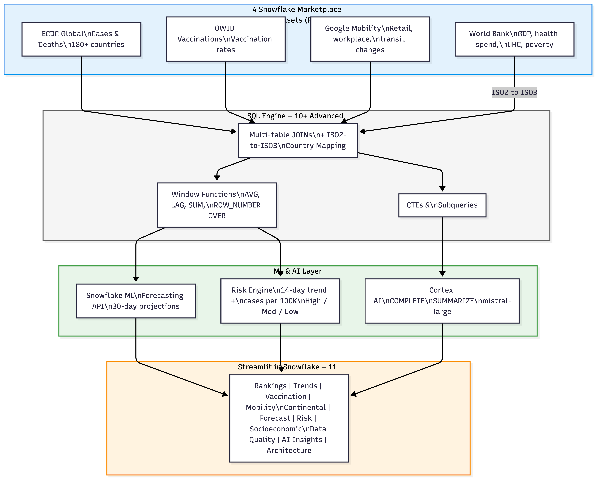

---

## What It Does

An 11-tab public health intelligence dashboard that helps non-technical decision makers (Health Ministers, policy advisors) understand COVID-19 outbreak trajectory at a glance:

- **ML Forecasting** — 30-day case projections per country using Snowflake ML Forecasting API
- **Risk Classification** — High / Moderate / Low tiers based on 14-day trend + cases per 100K
- **AI Summaries** — Cortex COMPLETE() and SUMMARIZE() generate plain-English outbreak narratives
- **4-Dataset Analysis** — JOINs across ECDC cases, OWID vaccinations, Google Mobility, and World Bank indicators
- **Fairness Disclosure** — Quantified data quality gaps and geographic reporting bias

---

## Architecture

### System Overview


### Data Pipeline
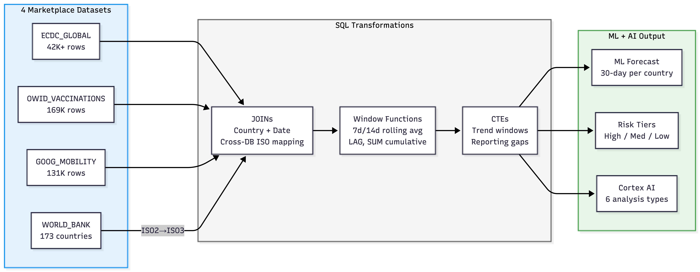

### Risk Classification Logic
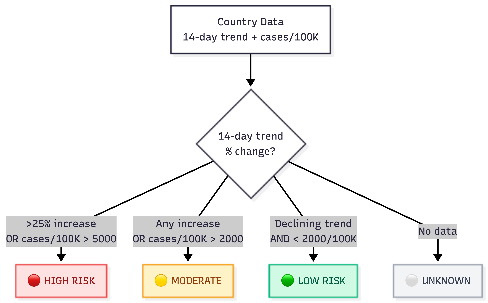

---

## Snowflake Features Used

| Category | Features |
|----------|----------|
| **SQL** | Window Functions (AVG, LAG, SUM, ROW_NUMBER OVER), CTEs (4 levels deep), Multi-table JOINs, Correlated Subqueries, CASE, DATEDIFF, LN() |
| **Cross-DB** | ISO2-to-ISO3 country code mapping (150+ countries in SQL CASE) joining COVID19_EPIDEMIOLOGICAL_DATA x SNOWFLAKE_PUBLIC_DATA_FREE |
| **ML** | Snowflake ML Forecasting API — per-country model training, 30-day projections, MAPE evaluation |
| **AI** | Cortex COMPLETE() with mistral-large (6 analysis types), Cortex SUMMARIZE() for auto data profiling |
| **Data** | 4 free Marketplace datasets, zero ETL |
| **UI** | Streamlit in Snowflake, 11 interactive tabs, @st.cache_data |

---

## Setup — How to Reproduce

### Prerequisites
- Snowflake account (free trial at [signup.snowflake.com](https://signup.snowflake.com))
- `ACCOUNTADMIN` role (default for trial accounts)

### Step 1: Create Database & Warehouse

Open a **SQL Worksheet** and run:

```sql
CREATE DATABASE IF NOT EXISTS HACKATHON;
CREATE SCHEMA IF NOT EXISTS HACKATHON.DATA;
CREATE WAREHOUSE IF NOT EXISTS HACKATHON_WH
  WITH WAREHOUSE_SIZE = 'XSMALL'
  AUTO_SUSPEND = 60
  AUTO_RESUME = TRUE;
USE DATABASE HACKATHON;
USE SCHEMA DATA;
USE WAREHOUSE HACKATHON_WH;
```

### Step 2: Get Marketplace Datasets

**Dataset 1 — COVID-19 Epidemiological Data (Starschema)**
1. Left sidebar > **Marketplace**
2. Search: `COVID-19 epidemiological`
3. Click **Get** > Accept > Keep default name `COVID19_EPIDEMIOLOGICAL_DATA`

**Dataset 2 — Snowflake Public Data (Free)**
1. Left sidebar > **Marketplace**
2. Search: `Snowflake Public Data`
3. Click **Get** > Accept > Creates `SNOWFLAKE_PUBLIC_DATA_FREE`

**Verify both datasets:**
```sql
SHOW TABLES IN DATABASE COVID19_EPIDEMIOLOGICAL_DATA;
SHOW SCHEMAS IN DATABASE SNOWFLAKE_PUBLIC_DATA_FREE;
```

### Step 3: Upload Architecture Images to Stage

```sql
CREATE OR REPLACE STAGE HACKATHON.DATA.APP_IMAGES;
```

Then in Snowflake UI:
1. Navigate: **Data** > **Databases** > `HACKATHON` > `DATA` > **Stages** > `APP_IMAGES`
2. Click **+ Files**
3. Upload `images/arch1.png`, `images/arch2.png`, `images/arch3.png`

### Step 4: Deploy the Streamlit App

1. Left sidebar > **Projects** > **Streamlit**
2. Click **+ Streamlit App**
3. Name: `Public Health Intelligence`
4. Database: `HACKATHON`, Schema: `DATA`, Warehouse: `HACKATHON_WH`
5. Delete default code, paste contents of `app7_covid_intelligence.py`
6. Click **Run**

### Step 5: Verify

The app should show:
- Blue hero banner with title
- 5 KPI cards (97 countries, 1.3M cases, etc.)
- 11 tabs starting with "How It Works"
- Architecture diagrams loading from stage

---

## Dashboard Screenshots

### Country Rankings
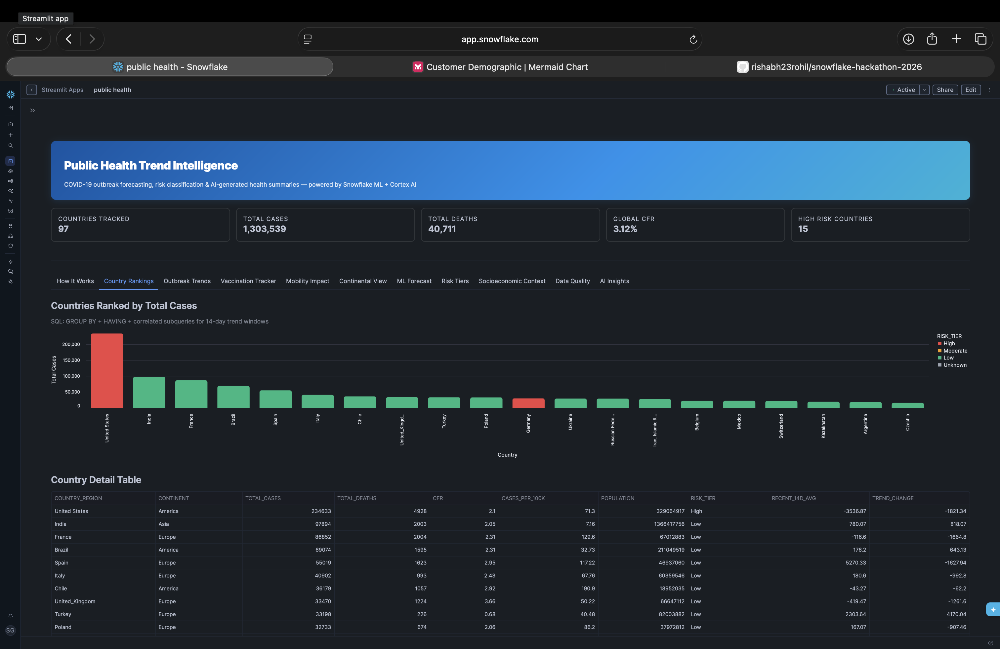

### Outbreak Trends
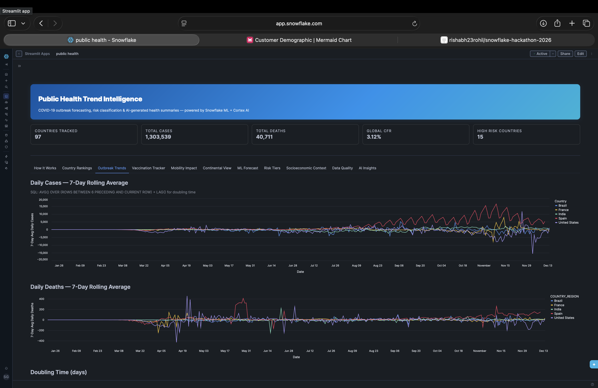

### Vaccination Tracker
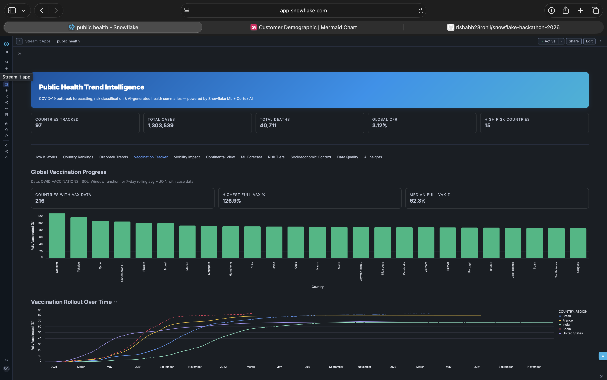

### Mobility Impact
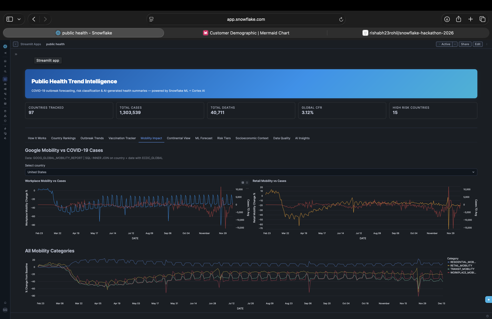

### Continental View
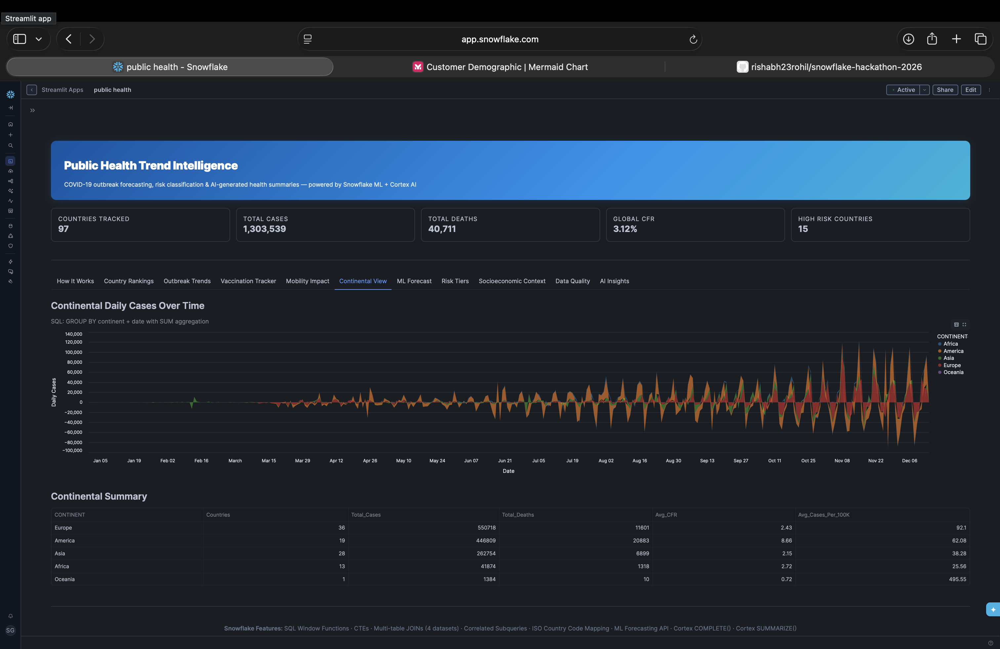

### ML Forecast (30-Day Projection)
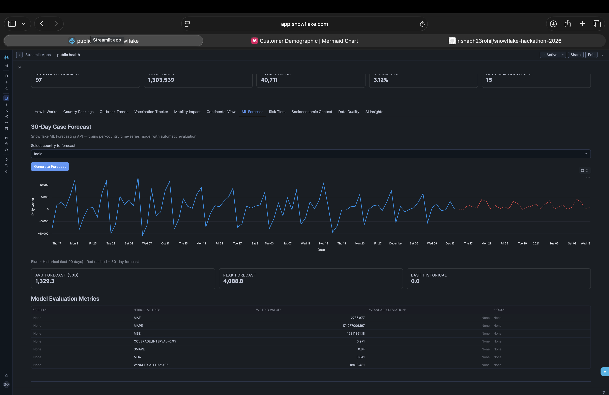

### Risk Tiers
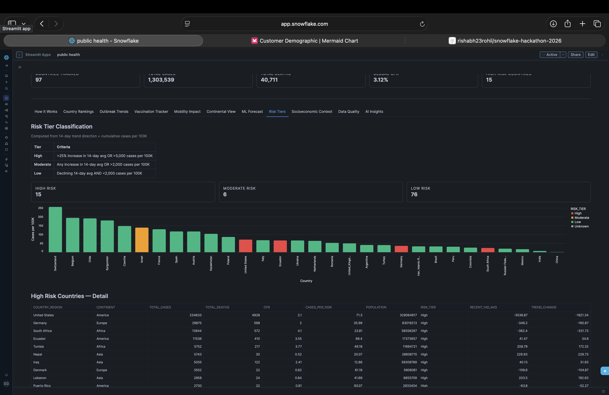

### Socioeconomic Context (World Bank x COVID JOIN)
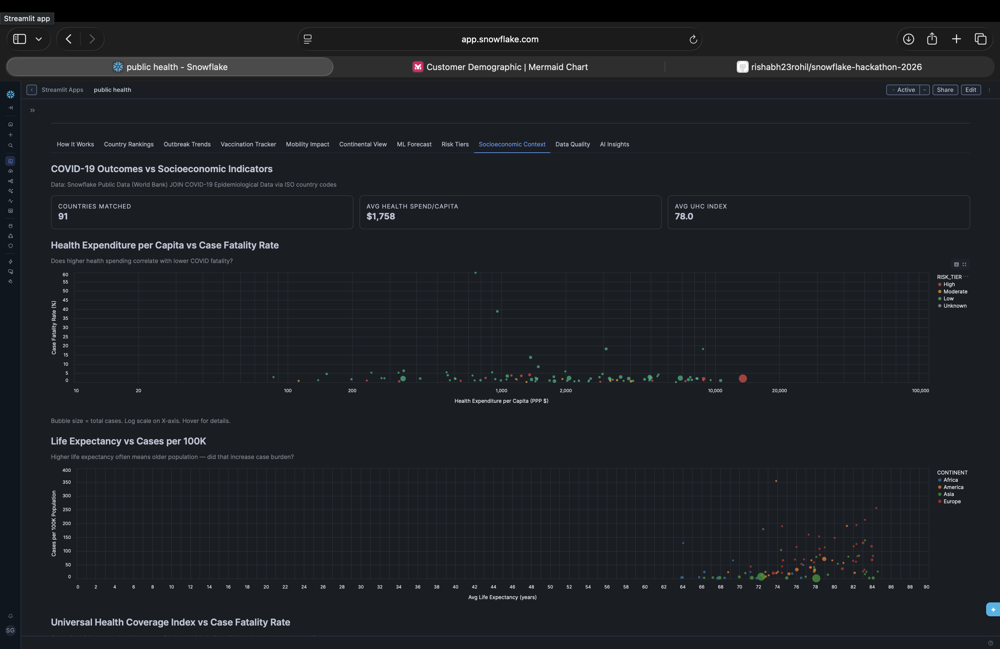

### Data Quality & Fairness
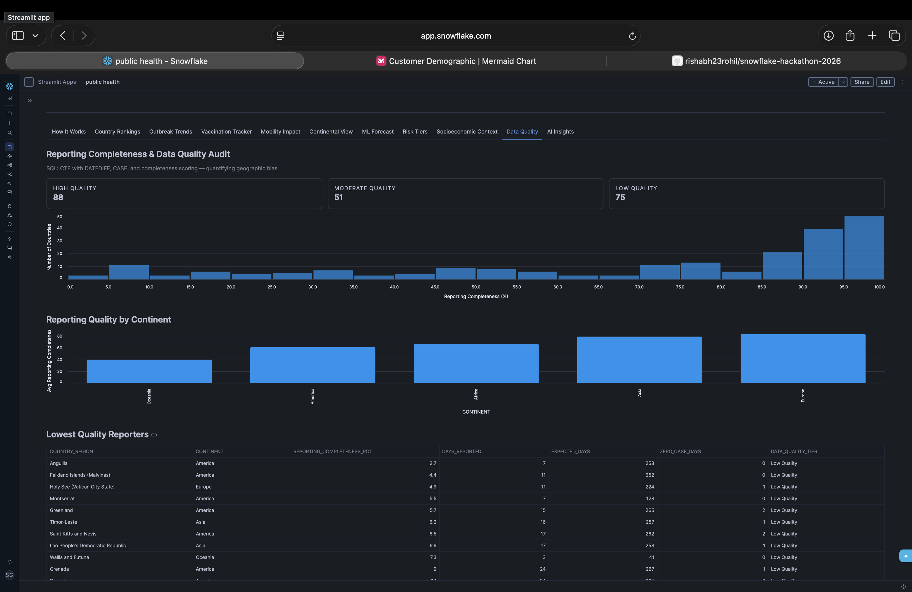

### AI Insights
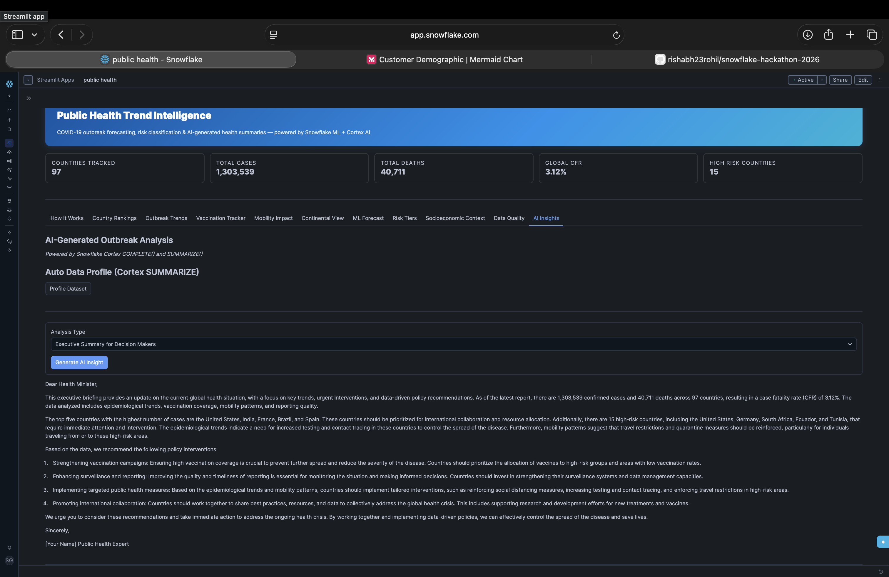

---

## Dashboard Tabs

| # | Tab | What It Shows | Key SQL / Feature |
|---|-----|---------------|-------------------|
| 0 | How It Works | Architecture diagrams, features, scoring alignment | Stage images, documentation |
| 1 | Country Rankings | Top 20 by cases, risk-tier colors | GROUP BY + HAVING + subqueries |
| 2 | Outbreak Trends | 7-day rolling avg, doubling time, CFR | AVG/LAG/SUM OVER windows, LN() |
| 3 | Vaccination Tracker | Vax progress + cases vs vaccination | JOIN ECDC x OWID |
| 4 | Mobility Impact | Workplace/retail mobility vs cases | JOIN ECDC x Google Mobility |
| 5 | Continental View | Stacked area by continent | GROUP BY continent + SUM |
| 6 | ML Forecast | 30-day projection per country | Snowflake ML Forecasting API |
| 7 | Risk Tiers | High/Moderate/Low classification | CASE + 14-day trend logic |
| 8 | Socioeconomic Context | Health spend vs CFR, poverty vs reporting | Cross-DB JOIN + ISO mapping |
| 9 | Data Quality | Reporting completeness, fairness disclosure | CTE + DATEDIFF + CASE scoring |
| 10 | AI Insights | 6 AI analysis types + auto profiling | Cortex COMPLETE + SUMMARIZE |

---

## Scoring Alignment — 100 Points

| Dimension | Weight | How We Score |
|-----------|--------|--------------|
| Technical Depth | 30 pts | 4-dataset JOINs, 10+ SQL queries, cross-DB ISO mapping, ML API, Cortex AI |
| Model Quality | 25 pts | ML Forecasting with MAPE eval, per-country projections, risk classification |
| Social Impact | 20 pts | Health minister briefings, fairness disclosure, underreporting hypothesis |
| Presentation | 15 pts | 11-tab dashboard, polished UI, architecture diagrams, interactive filters |
| Innovation | 10 pts | World Bank socioeconomic correlation (4th dataset), poverty analysis, doubling time |

---

## Files

```
snowflake/
├── app7_covid_intelligence.py   <- Main Streamlit app (1,267 lines)
├── setup.sql                    <- Database/schema/warehouse setup
├── images/
│   ├── arch1.png                <- System architecture diagram
│   ├── arch2.png                <- Data pipeline diagram
│   └── arch3.png                <- Risk classification diagram
├── VIDEO_SCRIPT.md              <- 4-min presentation script
├── mermaid_diagrams.md          <- Mermaid source code for diagrams
└── CSEGSA_Hackathon_2026.html   <- Problem statement
```

---

## Video Demo

[Watch the demo video](https://drive.google.com/file/d/1cK_BrJ8XTD4Fqf8DUE8WFoJS0KSAsQbQ/view?usp=sharing) | [Live App on Snowflake](https://app.snowflake.com/visknth/mkb56554/#/streamlit-apps/HACKATHON.DATA.BXV1TNY8FLY0L59Y)

See [VIDEO_SCRIPT.md](VIDEO_SCRIPT.md) for the presentation script.

---

## Team

- **Rishabh Rohil**
- **Ujjwal Bana**

---

Built for TAMU CSEGSA x Snowflake Hackathon 2026 | Track C: AI for Social Good
