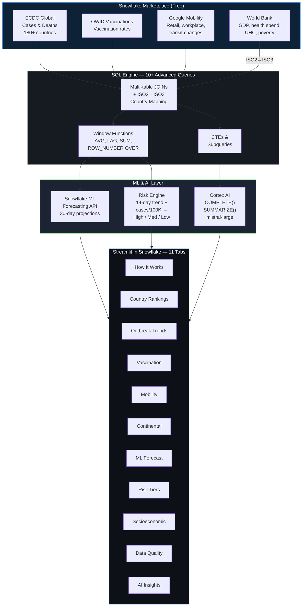
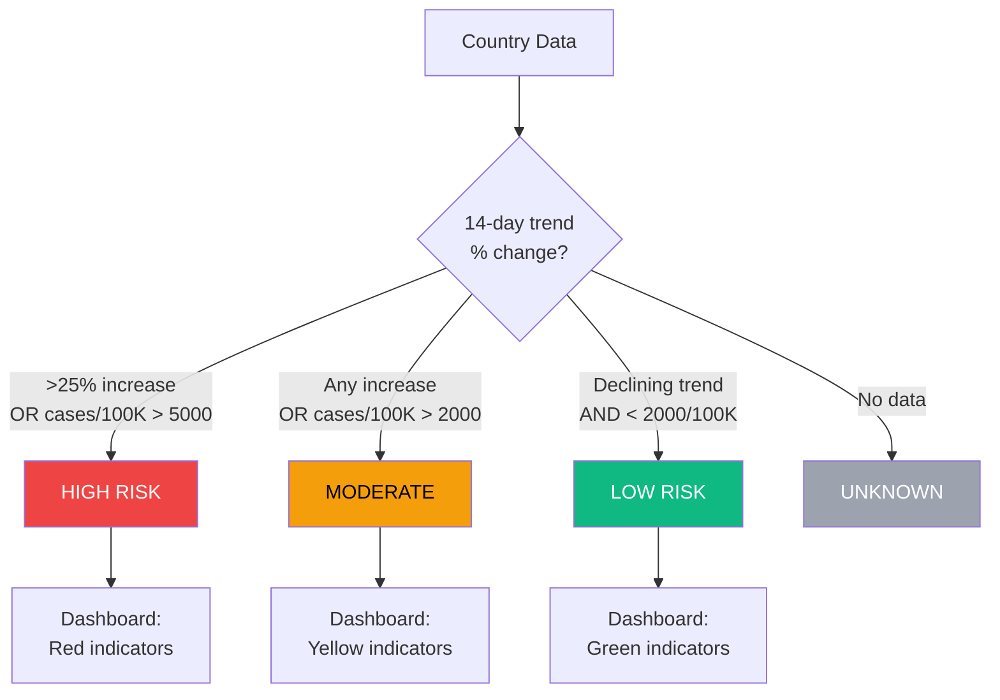
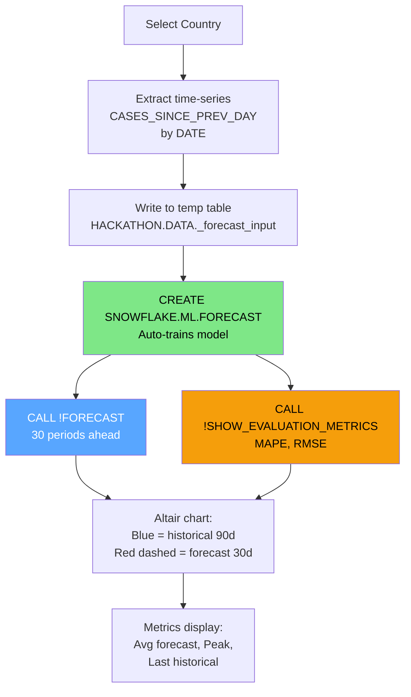

# Mermaid Diagrams — Public Health Trend Intelligence

Paste each diagram into https://mermaid.live to generate PNG images.

---

## 1. System Architecture

---

## 2. Data Pipeline Flow

```mermaid
flowchart LR
    subgraph Sources["4 Marketplace Datasets"]
        A["ECDC_GLOBAL<br/>42K+ rows"]
        B["OWID_VACCINATIONS<br/>169K rows"]
        C["GOOG_MOBILITY<br/>131K rows"]
        D["WORLD_BANK<br/>173 countries"]
    end

    subgraph Transform["SQL Transformations"]
        E["Window Functions<br/>7d/14d rolling avg<br/>LAG, SUM cumulative"]
        F["JOINs<br/>Country + Date<br/>Cross-DB ISO mapping"]
        G["CTEs<br/>Trend windows<br/>Reporting gaps"]
    end

    subgraph Output["ML + AI Output"]
        H["ML Forecast<br/>30-day per country"]
        I["Risk Classification<br/>High / Moderate / Low"]
        J["Cortex AI<br/>6 analysis types"]
    end

    subgraph Dashboard["Streamlit Dashboard"]
        K["11 Interactive Tabs<br/>Charts, Tables, AI"]
    end

    A --> F
    B --> F
    C --> F
    D -->|ISO2→ISO3| F
    F --> E
    E --> G
    G --> H
    G --> I
    G --> J
    H --> K
    I --> K
    J --> K

    style Sources fill:#0D2137,stroke:#58A6FF
    style Transform fill:#161B22,stroke:#30363D
    style Output fill:#1C2333,stroke:#7EE787
    style Dashboard fill:#0D1117,stroke:#58A6FF
```

---

## 3. Risk Classification Logic

---

## 4. Cross-Database JOIN Flow

```mermaid
flowchart LR
    subgraph DB1["COVID19_EPIDEMIOLOGICAL_DATA"]
        T1["ECDC_GLOBAL<br/>ISO3166_1 = 'US'<br/>(2-letter code)"]
    end

    subgraph MAPPING["SQL CASE Statement<br/>150+ country codes"]
        M["ISO2 → ISO3<br/>'US' → 'USA'<br/>'IN' → 'IND'<br/>'BR' → 'BRA'<br/>..."]
    end

    subgraph DB2["SNOWFLAKE_PUBLIC_DATA_FREE"]
        T2["WORLD_BANK_TIMESERIES<br/>GEO_ID = 'country/USA'<br/>(3-letter code)"]
    end

    subgraph RESULT["Merged Dataset"]
        R["91 countries matched<br/>COVID outcomes +<br/>GDP, health spend,<br/>UHC, life expectancy,<br/>poverty rate"]
    end

    T1 --> M
    M --> T2
    T1 --> RESULT
    T2 --> RESULT

    style DB1 fill:#0D2137,stroke:#58A6FF
    style DB2 fill:#0D2137,stroke:#58A6FF
    style MAPPING fill:#1C2333,stroke:#7EE787
    style RESULT fill:#161B22,stroke:#F59E0B
```

---

## 5. ML Forecasting Pipeline

